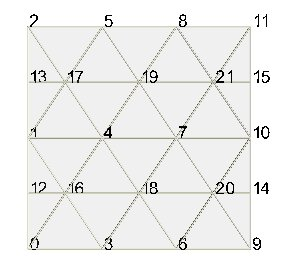
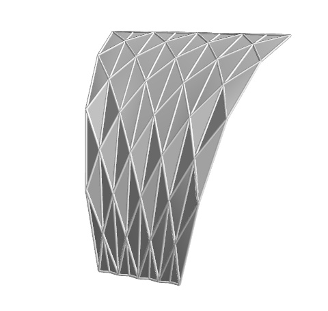

.. highlightlang:: python
	:linenothreshold: 3

.. currentmodule:: oricrete.folding2

=========
Use cases
=========

The crease pattern subclasses define the initial layout of crease pattern.
However, they do not contain any specification of "How to fold" the pattern.
The separation of the structure and of its reshaping is done deliberately to provide
a flexibility for combining several mathematical tasks using a single 
crease pattern model. Let us use a regular Yoshimura crease pattern with 3x4 elements
to document the possible use cases::

	from oricrete.folding2 import YoshimuraCreasePattern
	
	cp = YoshimuraCreasePattern(n_x=3, n_y=4)

rendering the pattern

Folding controlled by a target face
-----------------------------------
The introduction of a target face brings about design flexibility into the specification
of the folding problem. Note that the elementary examples shown so far 
in Chapter :ref:`First steps <first_steps>` were fully constrained to provide the number 
of system equations equal to the number of degrees of freedom. For complex crease patterns, however, 
the identification of admissible  kinematic constraint equations is tedious and non-intuitive task.
The idea of target faces exploits the fact that the nodes of a particular type of crease pattern
usually follow some geometrical shape during the folding. In the case of a regular Yoshimura pattern,
the nodes on the rib lines follow a circular shape. Only the nodes on the left and right edges
lie below the circle. For Miura-Ori crease pattern, the alternating nodes of the pattern move upwards 
or downwards.

.. _regular_yoshimura_3x4:

Regular Yoshimura crease pattern
^^^^^^^^^^^^^^^^^^^^^^^^^^^^^^^^

Let us start with the an example of target face for the Yoshimura crease pattern 
defined as a parabolic function:

.. math::
    z = 0.6 \cdot t \cdot r \cdot \left(1 - \frac{r}{1.2} \right)

where :math:`t \in \left<0,1\right>` represents the time factor used to control the incremetal simulation 
and :math:`r` the longitudinal parametric 
coordinate within the surface. The target face is represented by the 
:class:`CnstrTargetFace`
class with a symbolic specification of the surface in 3D: 

.. math::
	F := [x(r,s,t), y(r,s,t), z(r,s,t)]

The code defining the pattern and performing the simulation 
looks as follows (file ``example03_YCP_3x4_tf.py``):

.. literalinclude:: example03_YCP_3x4_tf.py
    :encoding: latin-1 

The target face ``face_z_t`` is included in the ``tf_lst`` together with the
array of nodes that should be "attracted" by the target face. In the present 
example all nodes have been required to have a minimum distance from the target face. 
The animation of the simulated folding process with an appended reverse sequence
of the calculated time steps shows the obtained results: 

+-----------------------------------------+--------------------------------------------+
|                                         |                                            |
| .. image:: example04_YCP_3x4_tf_01.gif  |  .. image:: example03_YCP_3x4_tf_02.gif    |
|    :width: 400px                        |     :width: 400px                          |
|    :height: 300px                       |     :height: 300px                         |
|                                         |                                            |
+-----------------------------------------+--------------------------------------------+

Note that the :class:`Folding` class automatically includes the constant length constraints
in the configuration of the underlying optimization problem. Another point to mention is 
the fact that 

Looking at the example the question arises, how did the crease pattern
find the desired form with valley creases along the rib and mountain creases along
the diagonal lines. In other types of models, the valleys and mountains are explicitly associated 
to the individual crease lines restricting the directions of folding. 
This information is not included in the current example based on the constant-length constraint.
In fact the constraint only introduces the non-linear (quadratic) kinematics 
of the pin-jointed framework. In the present form, the model does not know
anything about the mountain valley distribution and no foldability criteria are included. 

The particular folding mode gets triggered  
by providing the folding trend in terms of an appropriate initial displacement vector. 
In the present example, the ``init_tf_lst`` attribute has been used to 
tell the :class:`Folding` class how to generate the initial trial displacement vector.  
A general approach to initialization 
applicable to different types of crease patterns is described 
later in Sec. :ref:`Intialization<initialization>`.

.. _scaled_yoshimura_3x4:

Scaled Yoshimura crease pattern
^^^^^^^^^^^^^^^^^^^^^^^^^^^^^^^

In order to demonstrate the announced flexibility of the folding controlled by a target face 
let us consider a non-regular crease pattern applying the geometrical transformation
for a sheet with dimensions :math:`1.2 \times 0.8` m and :math:`3 \times 4` elements:

+-----------------------------------------+---------------------------------------------------------+
|                                         |                                                         |
| .. image:: example04_YCP_3x4_tf.jpg     | .. math::                                               |
|   :width: 400px                         |    \bar{x} = x                                          |
|   :height: 300px                        |                                                         |
|                                         | .. math::                                               |
|                                         |    \bar{y} =(y-0.4)\left(1-\frac{0.6}{1.2} x \right)    |
|                                         |                                                         |
|                                         | .. math::                                               |
|                                         |    \bar{z} = z                                          |
|                                         |                                                         |
+-----------------------------------------+---------------------------------------------------------+

Let us remark that in contrast to the regular Yoshimura crease pattern 
this crease pattern is not flat foldable. Indeed, the sum of alternating 
angles around the interior nodes is not zero as required for the flat foldability.
Still, the crease pattern provides enough flexibility to achieve the shape
prescribed by the target face. 

The geometrical transformation has been introduced using the ``geo_transform`` 
callable attribute of the :class:`CreasePattern` class as explained
:ref:`here<geo_trans>`. The code producing the example is 
given in ``example04_YCP_3x4_tf.py``:

.. literalinclude:: example04_YCP_3x4_tf.py
    :encoding: latin-1 

The parabolic target face from the previous example has been reused 
to control the folding process simulated for eight time steps:  

+-----------------------------------------+--------------------------------------------+
|                                         |                                            |
| .. image:: example04_YCP_3x4_tf_01.gif  |  .. image:: example04_YCP_3x4_tf_02.gif    |
|    :width: 400px                        |     :width: 400px                          |
|    :height: 300px                       |     :height: 300px                         |
|                                         |                                            |
+-----------------------------------------+--------------------------------------------+

In the shown example, all crease nodes have been included in the closest-point criteria
as indicated by the red marks. As a result, the optimization solver tried to position 
all of them as near to the target face as possible. In the present case, the solution
has been found quickly in a few second with eight time steps.

Let us note, however, that this example has been constructed using some background knowledge 
of the Yoshimura crease pattern. In particular, we have chosen the target face 
with regard to the fact that the pattern folds to 
a simply curved shape. As apparent from the :ref:`previously shown example<regular_yoshimura_3x4>`
of a  regular Yoshimura crease pattern the envelope curvature is constant.  
However, for the scaled pattern used in the example 
the curvature of the envelope
surface is not constant so that it cannot not perfectly fit with a simply curved circular 
or parabolic target face. In spite of the slight misfit 
between the curvature of the target surface and the curvature inherent to the crease
pattern the algorithm has quickly converged to the desired solution.

In a general case the misfit between the target face and the kinematics of the
crease pattern can be too large to find a solution. 
Therefore, refined control measures can be
appropriate to steer the folding to the desired shape. The first option is to 
require the fit of the surface only on a subset of crease nodes. The example
``example05_YCP_4x8_tf_bndr.py`` shows the result of a simulation with boundary
included included in the closest-point optimality criteria. The target face is the same 
as in the previous example. 

.. literalinclude:: example05_YCP_4x8_tf_bndr.py
    :encoding: latin-1 

The simulated folding process renders shapes that are similar to the previous example

+---------------------------------------------+-----------------------------------------------+
|                                             |                                               |
| .. image:: example05_YCP_4x8_tf_bndr01.gif  |  .. image:: example05_YCP_4x8_tf_bndr02.gif   |
|    :width: 400px                            |     :width: 400px                             |
|    :height: 300px                           |     :height: 300px                            |
|                                             |                                               |
+---------------------------------------------+-----------------------------------------------+

However, the distribution of fold angles in the interior region of the pattern 
is not regular any more:  

Combination of target face with kinematic constraints
^^^^^^^^^^^^^^^^^^^^^^^^^^^^^^^^^^^^^^^^^^^^^^^^^^^^^

.. literalinclude:: example_folding_YCP_3x4_tf_dof_cntrl.py
    :encoding: latin-1 

+------------------------------------------------------+--------------------------------------------------------+
|                                                      |                                                        |
| .. image:: example_folding_YCP_3x4_tf_dof_cntrl.gif  |  .. image:: example_folding_YCP_3x4_tf_dof_cntrl2.gif  |
|    :width: 460px                                     |     :width: 460px                                      |
|    :height: 330px                                    |     :height: 330px                                     |
|                                                      |                                                        |
+------------------------------------------------------+--------------------------------------------------------+

Purely kinematic folding
------------------------

With an equal number of system equations and degrees of freedom no target surface
is required. In fact, this kind of simulation reflects the manufacturing 
of a folded element using an appropriately designed folding device.
In the production, there is no such tool like a target surface. The form must 
be achieved by applying physical force. This task has actually originally 
motivated the development of the ``oricrete`` package. 

However, it is not a trivial task to identify admissible kinematic constraints 
leading to a folding of complex crease patterns. Even the design of the
lifting device for the Yoshimura pattern activating the desired vault shape is
non-intutitive and tedious. For specific cases, an identification of the constraint pattern
valid for an arbitrarily sized grid of Yoshimura 
elements is possible, however, there seem not to be a 
a simple and general approach to devising an lifting gadget 
for a given crease pattern.

For the discussed Yoshimura vault a generic kinematic constraint pattern has been identified  
iteratively using the trial-and-error method. 
The resulting generic constraint pattern renders  a single DOF folding problem
for an ``m`` x ``n`` Yoshimura crease pattern can be defined using the following function:

+-----------------------------------------+----------------------------------+
|                                         |  .. image:: yoshimura_3x4.jpg    |
|                                         |     :width: 400px                |
|                                         |     :height: 300px               |
|                                         |                                  |
|                                         |                                  |
| .. literalinclude:: example02.py        |  .. image:: yoshimura2_3x4.gif   | 
|    :encoding: latin-1                   |     :width: 400px                |
|                                         |     :height: 300px               |
|                                         |                                  |
|                                         |                                  |
+-----------------------------------------+----------------------------------+

Using this constraint pattern the number of kinematic equation equals the number of degrees of freedom.
The generic nature of the constraints is documented by invoking 
``get_constrained_YCP`` with ``6x8`` and ``12x12`` elements  

+----------------------------------------------+-----------------------------------------------+
| .. literalinclude:: example_02_YCP_6x8.py    | .. literalinclude:: example_02_YCP_12x10.py   |
+----------------------------------------------+-----------------------------------------------+
| .. image:: yoshimura2_6x8.gif                |  .. image:: yoshimura2_12x12.gif              |
|    :width: 400px                             |     :width: 400px                             |
|    :height: 300px                            |     :height: 300px                            |
+----------------------------------------------+-----------------------------------------------+

All the shown examples require initial displacement vector different from zero.
The fully constrained simulation procedures is based on the Newton-Raphson 
iteration scheme requiring the tangent operator in form of the system matrix. 
For the initial configuration ``U = 0`` the system matrix is singular, since
many admissible folding paths are possible starting from this configuration.
 
The choice of the desired 
folding branch with the particular distribution of mountain and valley creases 
has to be chosen explicitly. In the above examples
the simulation along desired folding branch was triggered by specifying the 
parabolic displacement shape as the initial configuration. The algorithm automatically 
maps to the nearest kinematically admissible configuration that lies on the solution branch of the vault folding.  

.. todo::
	Add the analysis of the number of degrees of freedom similarly to the paper.

.. _initialization:

Initialization
^^^^^^^^^^^^^^
In order to construct the initial vector ``U`` for the fully constrained problem the node 
displacements are generated such that they reflect the relative positions within the crease 
pattern during the folding. For the Yoshimura crease pattern, the nodes can be
mapped onto a parabolic surface using closest-point mapping.

.. todo::
	Demonstrate using an example.    

Form finding
------------

Lifting
-------

