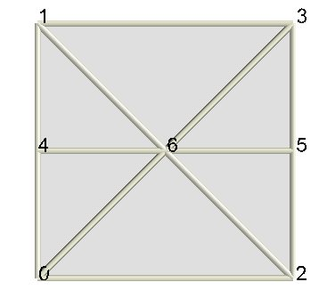
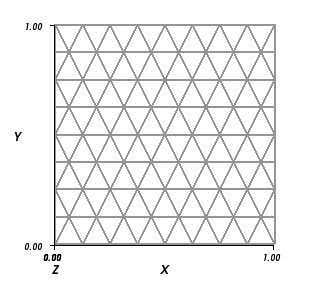
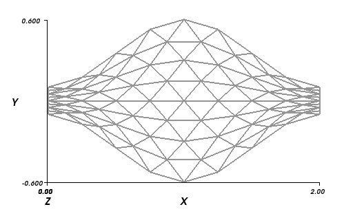

.. highlightlang:: python
	:linenothreshold: 5

.. currentmodule:: oricrete.folding2

.. tabularcolumns:: |l|r|

Yoshimura crease pattern
========================

Single crease pattern element
-----------------------------

The Yoshimura crease pattern (YCP), also referred to as diamond crease pattern
consists of straight valley fold (rib) and diagonal mountain fold.
For convenience a specialized class :class:`YoshimuraCreasePattern` can generate 
instances of the crease pattern for specified dimensions and subdivisions::

    from oricrete.folding2 import YoshimuraCreasePattern
    cp = YoshimuraCreasePattern(L_x=1, L_y=1, n_x=1, n_y=2)

The boundary length in x and y      
directions is given by parameters      
``L_x`` and ``L_y``. Number of crease   
pattern elements along x and y       
direction is specified using         
the parameters ``n_x`` and ``n_y``.     
The constructed crease pattern has the following base shape:

For the depicted crease pattern, the nodal numbers and the nodal coordinates
can be accessed using the interface of the base class :class:`CreasePattern`
The generated arrays of nodal coordinates, crease lines and facets 
are accessed as properties of the crease pattern object::

    print 'nodal coordinates', cp.X.T
    print 'nodal pairs defining lines', cp.L.T
    print 'nodal tripples defining facets', cp.F.T

In order to make the print out short, the transpose operator ``.T`` has been used
to get the following output.

.. literalinclude:: example01.out
   :encoding: latin-1

Grid representation of YCP
--------------------------

Yoshimura crease pattern can be seen as a grid of basic elements so that it 
can be constructed by specifying their number in the ``x`` and ``y`` directions.
At the same time, the dimensions ``L_x`` and ``L_y`` specify the lengths
of the whole crease pattern in the respective dimensions::

    from oricrete.folding2 import YoshimuraCreasePattern
    	
    ycp = YoshimuraCreasePattern(L_x=1, L_y=1, n_x=8, n_y=8)

..  _geo_trans:

Geometrical transformation of YCP
---------------------------------

Except of a simple scaling in ``x`` and ``y`` directions 
a geometrical mapping in the ``x``-``y`` plance is possible 
using the ``geo_transform`` class attribute. This attribute accepts a callable 
trait. Using this callable function, the nodal coordinates ``X`` are projected
to the positions defining the crease pattern::

    import numpy as np
    
    def gt(X):
        x, y, z = X.T
        return np.c_[2 * x, (y - 0.5) * (0.2 + np.sin(np.pi * x) ** 2), z]
    
    ycp.geo_transform = gt

The function ``gt`` stretches the pattern in the ``y`` direction into a sinusoidal shape.
so that above constructed ``8x8`` crease pattern now becomes:

Let us remark that this transformation is purely geometrical and no
foldability constraints have been considered.

Accessing nodes, lines and facets
---------------------------------
In order to introduce 
folding conditions within the pattern the grid structure can be conveniently used 
for addressing the individual nodes, lines and facets. Consider a 6x10 grid of the base elements::  

	from oricrete.folding2 import YoshimuraCreasePattern
	ycp = YoshimuraCreasePattern(L_x=1, L_y=1, n_x=6, n_y=10)

The produced crease pattern is depicted below with indicated nodal subgrids:

+-----------------------------------------+-----------------------------------+
|  The colored nodes                      |  .. image:: addressing.jpg        | 
|  indicate three node subrids that       |     :width: 400px                 |
|  can be accessed as property attributes |                                   |
|                                         |                                   |
|                                         |                                   |
| * ``N_h`` grid of node numbers          |                                   |
|   on horizontal valley lines            |                                   |
| * ``N_i`` grid of node numbers          |                                   |
|   numbers at the cross sections         |                                   |
|   of the diagonal mountain lines        |                                   |
| * ``N_v`` denote the remaining          |                                   |
|   nodes on the left and right vertical  |                                   |
|   boundary                              |                                   |
| * ``X_h`` grid of node coordinates      |                                   |
|   on horizontal valley lines.           |                                   |
| * ``X_i`` grid of node coordinates      |                                   |
|   at the cross sections                 |                                   |
|   of the diagonal mountain lines        |                                   |
| * ``X_v`` denote the remaining          |                                   |
|   nodes on the left and right vertical  |                                   |
|   boundary                              |                                   |
+-----------------------------------------+-----------------------------------+

The three node grids ``X_h``, ``X_i`` and ``X_v`` are represented by two-dimensional numpy arrays so that the usual slicing
operators can be used to extract subsets of node numbers or their coordinates. 
For example, the numbers of black nodes along the left boundary are obtained as::

	ycp.N_h[0,:]
	
The subgrid of even interior nodes is extracted using the following slice::

	ycp.N_i[::2,::2]
	
Masking nodes, lines and facets
-----------------------------------

.. todo::
	Waiting for the implementation. Can masked arrays be used?
		
Application of kinematic constraints
------------------------------------

In order to start the folding of the crease pattern, the :class:`Folding` 
class has to be constructed with an associated instance of :class:`YoshimuraCreasePattern` as 
crease pattern attribute::

	fold = Folding(cp=ycp)
	
The :class:`Folding` class automatically includes the constant length constraints in
the list of the equality constraint. The individual nodes can then be constrained
using the convenience functions :func:`fix`, :func:`move` and :func:`link` that generate
the constraints in the :class:`DofConstraints` format::

	fixed_left_boundary = fix(ycp.N_h[0,:],0)

This call generates a list of constraints in the format described in Sec. :ref:`Constraints <constraints>`.
The resulting constraint is displayed graphically on the next Figure using green lines.

